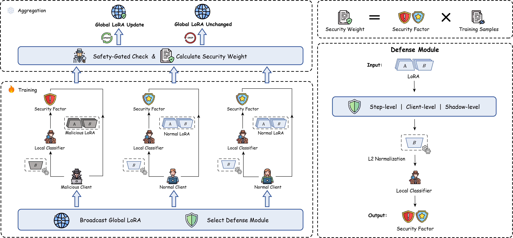

# Safe-FedLLM
This is the official implementation of **"Safe-FedLLM: Delving into the Safety of Federated Large Language Models"**.

Safe-FedLLM is a **probe-based defense framework** for **Federated Learning (FL)** in training **Large Language Models (LLMs)**, designed to mitigate security risks posed by malicious clients.
 

## Setup

Clone the repo and install the required packages.
```
cd Safe-FedLLM
git clone https://github.com/dmqx/Safe-FedLLM.git
conda create -n fedllm python=3.10
conda activate fedllm
pip install -r requirements.txt
```

## Quick Start
### Train LoRA-Probe
Train the LoRA-Probe offline using labeled benign/malicious ΔLoRA samples.

```
cd lora_classifier
python lora_classifier_train.py
```

### Run Federated Training
The federated learning framework is adapted from [OpenFedLLM](https://github.com/rui-ye/OpenFedLLM) and [FedLLM-Attack](https://github.com/19dx/FedLLM-Attack).
To run a federated learning process:
```
bash run_sft_example.sh
```

### Defense Modules
Safe-FedLLM supports four defense modules:
- **step-level**:  Defense based on each training step.
- **client-level**: Defense based on the final training step.
- **shadow-level**: Stable defense with a shadow LoRA branch for drift resilience.
- **none**: No defense.
